# Untraceable Feature — Technical Reference

## Overview

The **Untraceable** command is a Gen2v2 (ISO 18000-63) operation that instructs a tag to hide or reveal specific memory banks (EPC, TID, User) from standard inventory reads. This sample demonstrates:

- **`performUntraceable()`** — Hide the EPC, hide User memory, and show only TID on tags whose EPC word 2–3 matches `33333333`.
- **`restorePublicAccess()`** — Reverse the operation: re-expose EPC, TID, and User memory on the same tag population.

---

## EPC Memory Bank Layout

Understanding the EPC memory bank structure is critical for setting the access filter correctly.

```
EPC Memory Bank (Bank 01)
┌─────────────────────────────────────────────────────────┐
│ Word 0 (bits  0–15): CRC-16                             │
│ Word 1 (bits 16–31): Protocol Control (PC)              │
│ Word 2 (bits 32–47): EPC byte 0–1   ← filter starts here│
│ Word 3 (bits 48–63): EPC byte 2–3                       │
│ Word 4 (bits 64–79): EPC byte 4–5                       │
│ ...                                                     │
└─────────────────────────────────────────────────────────┘
```

- `setBitOffset(32)` skips CRC + PC words, pointing to the start of the actual EPC data.
- The sample targets tags whose first two EPC words (32 bits) equal `0x33333333`.

---

## Access Filter — How Tag Matching Works

Both operations use an `AccessFilter` to scope the command to a specific subset of tags. Only tags whose EPC (at the given offset, masked) matches the pattern will respond to the Untraceable command.

```java
AccessFilter accessFilter = new AccessFilter();

// 4-byte all-ones mask — every bit of the pattern must match exactly
byte[] tagMask = new byte[]{(byte) 0xff, (byte) 0xff, (byte) 0xff, (byte) 0xff};

accessFilter.TagPatternA.setMemoryBank(MEMORY_BANK.MEMORY_BANK_EPC);  // filter on EPC bank
accessFilter.TagPatternA.setTagPattern("33333333");                    // 32-bit EPC pattern to match
accessFilter.TagPatternA.setTagPatternBitCount(32);                    // pattern length = 32 bits
accessFilter.TagPatternA.setBitOffset(32);                             // skip CRC+PC (2 words = 32 bits)
accessFilter.TagPatternA.setTagMask(tagMask);                          // 4 bytes × 8 bits = 32-bit mask
accessFilter.TagPatternA.setTagMaskBitCount(tagMask.length * 8);       // = 32
accessFilter.setAccessFilterMatchPattern(FILTER_MATCH_PATTERN.A);     // use Pattern A only
```

### Filter Parameter Breakdown

| Parameter | Value | Meaning |
|-----------|-------|---------|
| `MemoryBank` | `MEMORY_BANK_EPC` | Match against EPC bank |
| `TagPattern` | `"33333333"` | 4 hex bytes = 32 bits to match |
| `TagPatternBitCount` | `32` | Declares length of pattern in bits |
| `BitOffset` | `32` | Skip the first 2 words (CRC-16 + PC) |
| `TagMask` | `{0xFF, 0xFF, 0xFF, 0xFF}` | All 32 bits are significant |
| `TagMaskBitCount` | `32` | Mask covers all 32 pattern bits |
| `MatchPattern` | `FILTER_MATCH_PATTERN.A` | Apply Pattern A only |

> **Critical:** `TagPattern`, `TagPatternBitCount`, and `TagMaskBitCount` must all be consistent. A 32-bit pattern requires a 4-byte mask and bit count of 32. Mismatches cause the filter to fail silently.

---

## `performUntraceable()` — Hide EPC, Show TID

### Purpose

Makes the tag invisible to standard EPC inventory. The tag will only respond with its TID. Useful for privacy/anti-counterfeiting scenarios.

### Code

```java
synchronized void performUntraceable() {
    if (!isReaderConnected())
        return;
    try {
        // --- Step 1: Build the access filter ---
        AccessFilter accessFilter = new AccessFilter();
        byte[] tagMask = new byte[]{(byte) 0xff, (byte) 0xff, (byte) 0xff, (byte) 0xff};
        accessFilter.TagPatternA.setMemoryBank(MEMORY_BANK.MEMORY_BANK_EPC);
        accessFilter.TagPatternA.setTagPattern("33333333");   // match tags with EPC starting 33333333
        accessFilter.TagPatternA.setTagPatternBitCount(32);
        accessFilter.TagPatternA.setBitOffset(32);            // skip CRC (word 0) and PC (word 1)
        accessFilter.TagPatternA.setTagMask(tagMask);
        accessFilter.TagPatternA.setTagMaskBitCount(tagMask.length * 8);
        accessFilter.setAccessFilterMatchPattern(FILTER_MATCH_PATTERN.A);

        // --- Step 2: Build the untraceable parameters ---
        Gen2v2 gen2V2 = new Gen2v2();
        Gen2v2.UntraceableParams untraceableParams = gen2V2.new UntraceableParams();

        untraceableParams.setPassword(Long.parseLong("12345678", 16)); // access password = 0x12345678
        untraceableParams.setShowEpc(false);   // do NOT show EPC during inventory
        untraceableParams.setHideEpc(true);    // actively hide EPC
        untraceableParams.setShowUser(false);  // hide User memory bank
        untraceableParams.setHideUser(true);   // actively hide User memory bank
        untraceableParams.setEpcLen(6);        // truncated EPC response length = 6 words if shown
        untraceableParams.setTid(UNTRACEABLE_TID.SHOW_TID); // show TID during inventory

        // --- Step 3: Execute ---
        reader.Actions.purgeTags();            // clear tag buffer before operation
        reader.Actions.gen2v2Access.untraceable(untraceableParams, accessFilter, null);

    } catch (InvalidUsageException e) {
        e.printStackTrace();
    } catch (OperationFailureException e) {
        e.printStackTrace();
    }
}
```

### Untraceable Parameter Effects

| Parameter | Value | Effect on Tag |
|-----------|-------|---------------|
| `setPassword` | `0x12345678` | Access password required by tag |
| `setShowEpc` | `false` | EPC will NOT appear in inventory responses |
| `setHideEpc` | `true` | Tag sets EPC hide bit in its config |
| `setShowUser` | `false` | User bank hidden from reads |
| `setHideUser` | `true` | Tag sets User hide bit |
| `setEpcLen` | `6` | If EPC were shown, truncate to 6 words |
| `setTid` | `SHOW_TID` | TID remains visible — tag responds with TID |

---

## `restorePublicAccess()` — Re-expose EPC and User Memory

### Purpose

Reverses the untraceable operation. The tag returns to its default mode where EPC, TID, and User memory are all visible.

### Code

```java
synchronized void restorePublicAccess() {
    if (!isReaderConnected())
        return;
    try {
        // --- Step 1: Build the access filter (same target population) ---
        AccessFilter accessFilter = new AccessFilter();
        byte[] tagMask = new byte[]{(byte) 0xff, (byte) 0xff, (byte) 0xff, (byte) 0xff};
        accessFilter.TagPatternA.setMemoryBank(MEMORY_BANK.MEMORY_BANK_EPC);
        accessFilter.TagPatternA.setTagPattern("33333333");
        accessFilter.TagPatternA.setTagPatternBitCount(16 * 2);  // = 32 bits
        accessFilter.TagPatternA.setBitOffset(32);
        accessFilter.TagPatternA.setTagMask(tagMask);
        accessFilter.TagPatternA.setTagMaskBitCount(tagMask.length * 8);
        accessFilter.setAccessFilterMatchPattern(FILTER_MATCH_PATTERN.A);

        // --- Step 2: Build restore parameters ---
        Gen2v2 gen2V2 = new Gen2v2();
        Gen2v2.UntraceableParams untraceableParams = gen2V2.new UntraceableParams();

        untraceableParams.setPassword(Long.parseLong("12345678", 16)); // same access password
        untraceableParams.setHideEpc(false);   // clear EPC hide bit
        untraceableParams.setShowEpc(true);    // explicitly show EPC
        untraceableParams.setTid(UNTRACEABLE_TID.SHOW_TID); // keep TID visible
        untraceableParams.setShowUser(true);   // re-expose User memory bank

        // --- Step 3: Execute ---
        reader.Actions.purgeTags();
        reader.Actions.gen2v2Access.untraceable(untraceableParams, accessFilter, null);

    } catch (InvalidUsageException e) {
        e.printStackTrace();
    } catch (OperationFailureException e) {
        e.printStackTrace();
    }
}
```

### Restore Parameter Effects

| Parameter | Value | Effect on Tag |
|-----------|-------|---------------|
| `setPassword` | `0x12345678` | Must match the password used to hide |
| `setHideEpc` | `false` | Clears the EPC hide bit |
| `setShowEpc` | `true` | Explicitly asserts EPC visibility |
| `setTid` | `SHOW_TID` | TID remains visible |
| `setShowUser` | `true` | User memory bank re-exposed |

> **Note:** Both `setHideEpc(false)` and `setShowEpc(true)` are needed. Setting only one may leave the tag in an ambiguous state depending on SDK defaults.

---

## Flow Charts

### `performUntraceable()` Flow

```mermaid
flowchart TD
    A([🚀 performUntraceable&#40;&#41;]) --> B{isReaderConnected?}
    B -- ❌ No --> C([return])
    B -- ✅ Yes --> D

    subgraph FILTER ["📋 Build Access Filter"]
        D["🏷️ Bank: EPC\nPattern: 33333333\nBitCount: 32\nBitOffset: 32\nMask: FF FF FF FF"]
    end

    FILTER --> E

    subgraph PARAMS ["⚙️ Build UntraceableParams"]
        E["🔑 Password: 0x12345678\n🙈 ShowEpc: false\n🔒 HideEpc: true\n🙈 ShowUser: false\n🔒 HideUser: true\n📏 EpcLen: 6\n🔍 TID: SHOW_TID"]
    end

    PARAMS --> F["🗑️ purgeTags()"]
    F --> G["📡 gen2v2Access.untraceable&#40;\n  untraceableParams,\n  accessFilter,\n  null\n&#41;"]
    G --> H{G2V2 Op Status?}

    H -- "getG2v2OpStatus&#40;&#41; == null" --> I["✅ SUCCESS\nLog: Untraceable OK\nTag EPC is now HIDDEN\nTID is VISIBLE"]
    H -- "getG2v2OpStatus&#40;&#41; != null" --> J["❌ FAILURE\nLog: Untraceable ERROR\nCheck: wrong password?\nTag not Gen2v2?"]

    style A fill:#4CAF50,color:#fff,stroke:#388E3C
    style C fill:#f44336,color:#fff,stroke:#D32F2F
    style I fill:#4CAF50,color:#fff,stroke:#388E3C
    style J fill:#f44336,color:#fff,stroke:#D32F2F
    style FILTER fill:#E3F2FD,stroke:#1565C0,color:#0D47A1
    style PARAMS fill:#FFF3E0,stroke:#E65100,color:#BF360C
    style F fill:#7E57C2,color:#fff,stroke:#512DA8
    style G fill:#0288D1,color:#fff,stroke:#01579B
    style H fill:#FF9800,color:#fff,stroke:#E65100
```



---

### `restorePublicAccess()` Flow

```mermaid
flowchart TD
    A([🔓 restorePublicAccess&#40;&#41;]) --> B{isReaderConnected?}
    B -- ❌ No --> C([return])
    B -- ✅ Yes --> D

    subgraph FILTER ["📋 Build Access Filter"]
        D["🏷️ Bank: EPC\nPattern: 33333333\nBitCount: 32\nBitOffset: 32\nMask: FF FF FF FF"]
    end

    FILTER --> E

    subgraph PARAMS ["⚙️ Build UntraceableParams — RESTORE"]
        E["🔑 Password: 0x12345678\n✅ ShowEpc: true\n🔓 HideEpc: false\n🔍 TID: SHOW_TID\n✅ ShowUser: true"]
    end

    PARAMS --> F["🗑️ purgeTags()"]
    F --> G["📡 gen2v2Access.untraceable&#40;\n  untraceableParams,\n  accessFilter,\n  null\n&#41;"]
    G --> H{G2V2 Op Status?}

    H -- "null = SUCCESS" --> I["✅ Tag RESTORED\nEPC: VISIBLE ✅\nTID: VISIBLE ✅\nUser: VISIBLE ✅"]
    H -- "non-null = FAILURE" --> J["❌ Restore FAILED\nLog: Untraceable ERROR\nVerify password & tag state"]

    style A fill:#2196F3,color:#fff,stroke:#1565C0
    style C fill:#f44336,color:#fff,stroke:#D32F2F
    style I fill:#4CAF50,color:#fff,stroke:#388E3C
    style J fill:#f44336,color:#fff,stroke:#D32F2F
    style FILTER fill:#E3F2FD,stroke:#1565C0,color:#0D47A1
    style PARAMS fill:#E8F5E9,stroke:#2E7D32,color:#1B5E20
    style F fill:#7E57C2,color:#fff,stroke:#512DA8
    style G fill:#0288D1,color:#fff,stroke:#01579B
    style H fill:#FF9800,color:#fff,stroke:#E65100
```



---

### Full Operation Lifecycle

```mermaid
flowchart TD
    START(["🏷️ TAG — Initial State\nEPC ✅ | TID ✅ | User ✅"])

    START --> INV1["📡 Standard Inventory\nReader sees: EPC + TID"]

    INV1 --> MENU1["👆 User taps Menu → Start\nor presses hardware trigger"]

    MENU1 --> UT["🚀 performUntraceable&#40;&#41;\nHide EPC + User\nShow TID only"]

    UT --> HIDDEN(["🙈 TAG — Hidden State\nEPC ❌ | TID ✅ | User ❌"])

    HIDDEN --> INV2["📡 Standard Inventory\nReader sees: TID only\n&#40;EPC is blank / not returned&#41;"]

    INV2 --> MENU2["👆 User taps Menu → Restore Public Access"]

    MENU2 --> RA["🔓 restorePublicAccess&#40;&#41;\nShowEpc=true\nHideEpc=false\nShowUser=true"]

    RA --> RESTORED(["✅ TAG — Restored State\nEPC ✅ | TID ✅ | User ✅"])

    RESTORED --> INV3["📡 Standard Inventory\nReader sees: EPC + TID again"]

    style START fill:#4CAF50,color:#fff,stroke:#2E7D32
    style HIDDEN fill:#f44336,color:#fff,stroke:#B71C1C
    style RESTORED fill:#4CAF50,color:#fff,stroke:#2E7D32
    style UT fill:#FF9800,color:#fff,stroke:#E65100
    style RA fill:#2196F3,color:#fff,stroke:#1565C0
    style INV1 fill:#607D8B,color:#fff,stroke:#37474F
    style INV2 fill:#607D8B,color:#fff,stroke:#37474F
    style INV3 fill:#607D8B,color:#fff,stroke:#37474F
    style MENU1 fill:#9C27B0,color:#fff,stroke:#6A1B9A
    style MENU2 fill:#9C27B0,color:#fff,stroke:#6A1B9A
```



---

## Event Handling — Confirming the Operation

After `gen2v2Access.untraceable()` is called, the SDK fires `eventReadNotify()`. The result is inspected via `getG2v2OpStatus()`:

```java
public void eventReadNotify(RfidReadEvents e) {
    TagData[] myTags = reader.Actions.getReadTags(100);
    if (myTags != null) {
        for (int index = 0; index < myTags.length; index++) {

            // --- Standard read result ---
            Log.d(TAG, "1. Tag ID = " + myTags[index].getTagID());
            Log.d(TAG, "2. ACCESS code = " + myTags[index].getOpCode());

            if (myTags[index].getOpCode() == ACCESS_OPERATION_CODE.ACCESS_OPERATION_READ &&
                    myTags[index].getOpStatus() == ACCESS_OPERATION_STATUS.ACCESS_SUCCESS) {
                if (myTags[index].getMemoryBankData().length() > 0) {
                    Log.d(TAG, "3. Mem Bank = " + myTags[index].getMemoryBank());
                    Log.d(TAG, "4. Mem Bank Data = " + myTags[index].getMemoryBankData());
                }
            }

            // --- Gen2v2 Untraceable result ---
            if (myTags[index].getG2v2OpStatus() == null) {
                // null status = SUCCESS
                Log.d(TAG, "5. Untraceable OK: EPC=" + myTags[index].getTagID() +
                        " , G2V2 response= " + myTags[index].getG2v2Response() +
                        " ,op=" + myTags[index].getG2v2OpCode() +
                        " ,status=" + myTags[index].getG2v2OpStatus() +
                        " ,opCode=" + myTags[index].getOpCode());
                Log.d(TAG, "Untraceable Mem Bank Data " + myTags[index].getMemoryBankData());
                Log.d(TAG, "Untraceable EPC= " + myTags[index].getTagID());
            } else {
                // non-null status = FAILURE
                Log.d(TAG, "Untraceable ERROR Status=" + myTags[index].getG2v2OpStatus()
                        + " ,response=" + myTags[index].getG2v2Response());
            }
        }
    }
}
```

### G2V2 Status Interpretation

| `getG2v2OpStatus()` | Meaning |
|---------------------|---------|
| `null` | Command succeeded — tag accepted and applied the untraceable settings |
| Non-null value | Command failed — check `getG2v2Response()` for the error code |

Common failure causes:
- Wrong access password
- Tag does not support Gen2v2
- Filter didn't match any tags
- Tag is in a permalocked state

---

## UI Integration

| UI Action | Method Called | Result |
|-----------|--------------|--------|
| Menu → **Start** | `performUntraceable()` | Hides EPC + User, shows TID |
| Menu → **Restore Public Access** | `restorePublicAccess()` | Restores EPC + User visibility |
| Menu → **Access** | `performUntraceableHideEPCTest()` | Reads EPC bank from offset 2 (diagnostic) |
| Hardware trigger pressed | `performInventory()` | Standard EPC inventory |
| Hardware trigger released | `stopInventory()` | Stops inventory |

---

## Key Constants

```java
// Access password programmed on the test tags
private static final long ACCESS_PASSWORD = Long.parseLong("12345678", 16); // = 0x12345678

// EPC pattern used to identify the test tag population
private static final String EPC_PATTERN = "33333333";  // first 32 bits of EPC after PC word

// EPC bit offset in EPC memory bank
// Word 0 = CRC (16 bits), Word 1 = PC (16 bits) → EPC data starts at bit 32
private static final int EPC_DATA_BIT_OFFSET = 32;
```

---

## Common Mistakes to Avoid

| Mistake | Consequence | Correct Approach |
|---------|-------------|-----------------|
| Pattern `"3333"` (16 bits) with `BitCount=32` | Filter never matches tags | Pattern length in hex chars must equal `BitCount / 4` |
| Mask byte count < pattern byte count | Only partial bits evaluated | `TagMaskBitCount` = `tagMask.length * 8` = `TagPatternBitCount` |
| `setHideEpc(false)` without `setShowEpc(true)` | EPC may stay hidden (SDK default is undefined) | Always set both to be explicit |
| Wrong or zero password | `OperationFailureException` with access error | Password must match the tag's programmed access password |
| Calling without `purgeTags()` | Stale tag data in buffer pollutes results | Always call `purgeTags()` before the untraceable operation |
